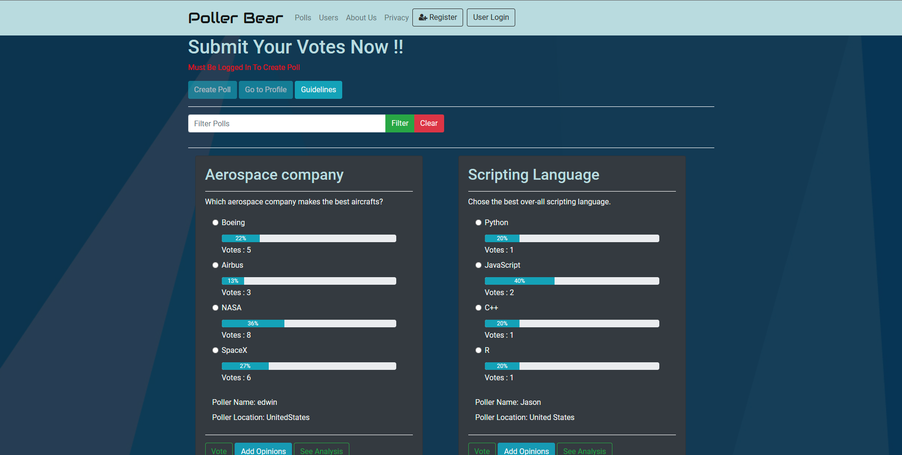
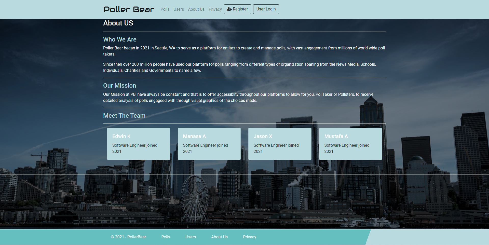
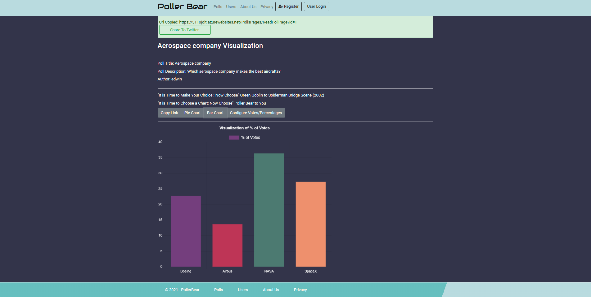
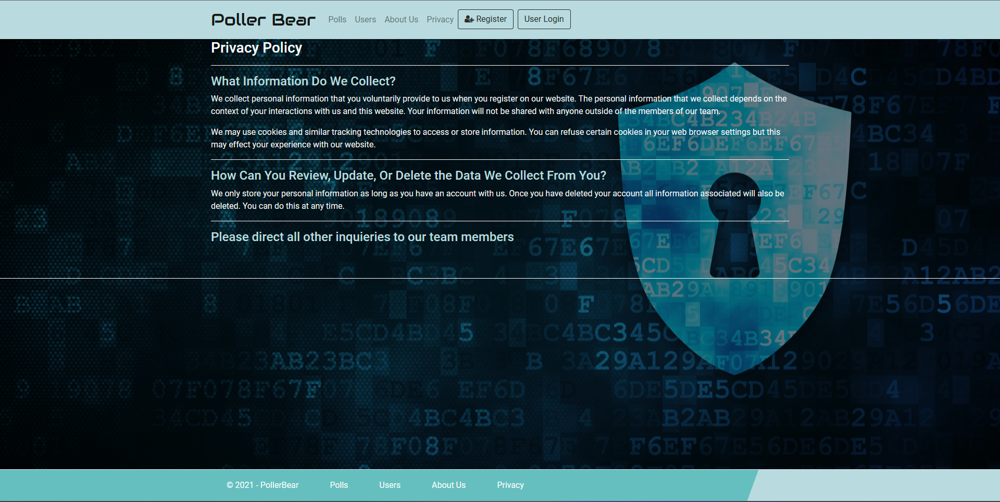

# PollerBear - Polling App (Sept. 2022 – Dec. 2022)

A polling app that enables users to create and participate in polls worldwide.

## Web Site Url : https://5110jolt.azurewebsites.net/

## Key Contributions
- Developed on a team of 4 using Agile (Scrumban) methodologies
- Implemented a registration system, designed and executed the UI/UX for the Home, Poll, and User pages
- Collaborated in developing search, Twitter sharing, and graph analytics features, and achieved 100% code coverage
- Developed an authentication system for users with admin privileges to perform CRUD on Users and Articles

## Pages
- Login/Signup
- Dashboard
- Articles
- Users/Articles Table

## Technologies Used
- C#
- ASP.NET
- Azure
- GitHub
- HTML
- CSS
- JavaScript
- Chart.js
- Bootstrap

## Deployment
Deployed on Azure

## Feedback
Received top-rated feedback from senior dev leads (Over 50 students across 13 teams)

## Demo

<h3 align="center"> Polling Page </h3>

<h3 align="center"> About Us </h3>

<h3 align="center"> Analytics</h3>

<h3 align="center"> Privacy Policy </h3>

